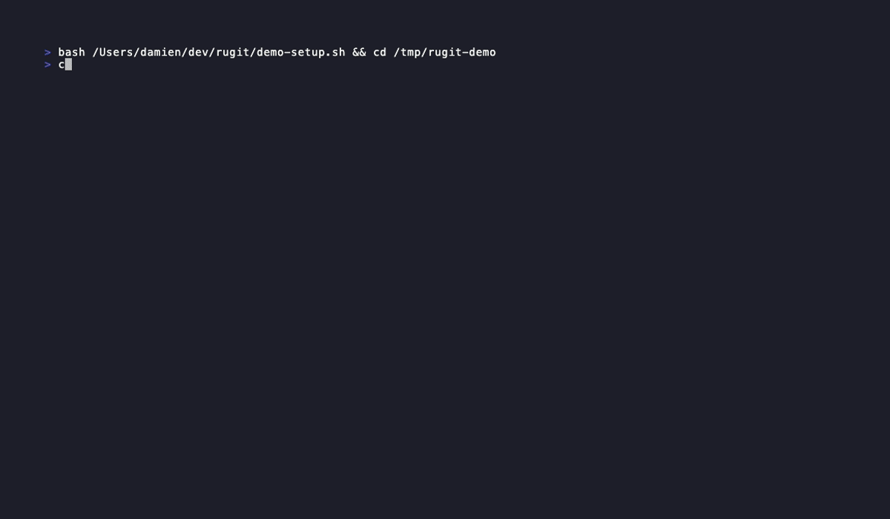

#+title: rugit
#+description: A Magit-inspired terminal UI for Git and Jujutsu, written in Rust

A keyboard-driven terminal UI for [[https://git-scm.com/][Git]] and [[https://github.com/martinvonz/jj][Jujutsu (jj)]], heavily inspired by [[https://magit.vc/][Magit]].
Built in Rust for speed and portability.

* Features

- *Magit-like status buffer* — staged, unstaged, and untracked changes at a glance
- *Interactive staging* — stage/unstage individual files, hunks, or lines
- *Inline diffs* — expand any change to see a syntax-highlighted diff
- *Commit workflow* — compose commit messages in your =EDITOR= with a full diff summary
- *Branch management* — create, rename, delete, and switch branches
- *Log view* — navigate commit history with search and filtering
- *Stash support* — stash, pop, apply, and inspect stashes
- *Rebase & merge* — interactive rebase, merge with conflict resolution helpers
- *Jujutsu compatibility* — first-class support for =jj= repositories alongside Git
- *Keyboard-first* — every action reachable from the keyboard; no mouse required
- *Fast* — written in Rust; cold-start in milliseconds even on large repositories

* Installation

** From source

Requires [[https://rustup.rs/][Rust]] 1.75 or later.

#+begin_src sh
git clone https://github.com/yourname/rugit
cd rugit
cargo install --path .
#+end_src

** Cargo

#+begin_src sh
cargo install rugit
#+end_src

* Usage

Run =rugit= from anywhere inside a Git or Jujutsu repository:

#+begin_src sh
rugit
#+end_src

rugit opens the *status buffer* by default. From there every workflow is one
or two keystrokes away.

* Key bindings

Keys are chords where noted: press the first key to open a menu, then the second key to run the action.

** Navigation

| Key             | Action                              |
|-----------------+-------------------------------------|
| =j= / =↓=       | Move down                           |
| =k= / =↑=       | Move up                             |
| =Tab=           | Expand / collapse diff              |
| =Enter=         | Preview commit at point             |
| =Ctrl-d= / =Ctrl-u= | Page down / up                  |
| =l=             | Open log buffer                     |
| =g=             | Refresh                             |
| =?=             | Show key binding help               |
| =Esc=           | Close help                          |
| =q=             | Quit (or close help / log view)     |

** Staging

| Key | Action                                  |
|-----+-----------------------------------------|
| =s= | Stage file or hunk at point             |
| =u= | Unstage file or hunk at point           |
| =x= | Discard changes at point                |
| =S= | Stage all changes                       |
| =U= | Unstage all changes                     |
| =V= | Visual mode (select a range of lines)   |

** Commits (=c=)

| Key   | Action                                  |
|-------+-----------------------------------------|
| =c c= | Commit staged changes                   |
| =c a= | Amend last commit                       |
| =c F= | Instant fixup into a commit             |
| =c S= | Instant squash into a commit            |

** Rebase (=r=)

| Key   | Action                                  |
|-------+-----------------------------------------|
| =r w= | Reword a commit's message               |
| =r k= | Remove a commit                         |

** Stash (=z=)

| Key   | Action                                  |
|-------+-----------------------------------------|
| =z z= | Stash changes                           |
| =z p= | Pop latest stash                        |
| =z a= | Apply latest stash                      |
| =z d= | Drop latest stash                       |
| =z l= | List stashes                            |

** Remotes

| Key   | Action                                  |
|-------+-----------------------------------------|
| =p p= | Push to upstream                        |
| =p f= | Force-push (with-lease)                 |
| =F=   | Pull from upstream                      |

** Branches (=b=)

| Key   | Action                                  |
|-------+-----------------------------------------|
| =b b= | Checkout branch                         |
| =b c= | Create and checkout new branch          |
| =b d= | Delete branch                           |
| =b r= | Rename current branch                   |

** Log buffer

| Key           | Action                                  |
|---------------+-----------------------------------------|
| =j= / =k=     | Move down / up                          |
| =Enter=       | Preview commit                          |
| =/=           | Filter by hash, author, or message      |
| =Esc=         | Clear filter                            |
| =q=           | Return to status                        |

* Jujutsu support

rugit detects whether the current repository is managed by =jj= and switches
its backend accordingly. When running in jj mode:

- The status buffer reflects =jj status= output
- Staging is replaced by jj's first-class *change* model — no index required
- Commits map to jj *changes* (=@=, parents, descendants)
- =c c= calls =jj commit=; =c a= calls =jj squash= (amend)
- The log buffer renders the change graph from =jj log=
- Branch operations use =jj bookmark= commands
- Co-located repositories (both =.git= and =.jj= present) are supported; you
  can choose which backend to use with =--backend git|jj=

* Configuration

rugit reads configuration from =~/.config/rugit/config.toml=:

#+begin_src toml
# Which backend to prefer when both .git and .jj are present
# Options: "git" | "jj" | "auto" (default)
backend = "auto"

# Open commit messages in this editor (falls back to $EDITOR)
editor = "nvim"

# Colour theme: "default" | "catppuccin" | "gruvbox" | "nord" | path to theme file
theme = "default"

[keybindings]
# Override individual key bindings
stage   = "s"
unstage = "u"
commit  = "c c"
#+end_src

* Architecture

#+begin_example
rugit/
├── src/
│   ├── main.rs          # Entry point, CLI argument parsing
│   ├── app.rs           # Top-level application state and event loop
│   ├── backend/
│   │   ├── mod.rs       # Backend trait (shared interface for Git and jj)
│   │   ├── git.rs       # Git backend (libgit2 via git2 crate)
│   │   └── jj.rs        # Jujutsu backend (spawns jj subprocess)
│   ├── ui/
│   │   ├── mod.rs       # TUI root; Ratatui layout
│   │   ├── status.rs    # Status buffer widget
│   │   ├── log.rs       # Log / graph buffer widget
│   │   ├── diff.rs      # Inline diff renderer
│   │   ├── commit.rs    # Commit message editor integration
│   │   └── popup.rs     # Help, branch, stash popups
│   ├── keybindings.rs   # Key binding registry and dispatch
│   └── config.rs        # Configuration loading (toml)
├── Cargo.toml
└── README.org
#+end_example

Key dependencies:

| Crate     | Purpose                                |
|-----------+----------------------------------------|
| [[https://crates.io/crates/ratatui][ratatui]]   | Terminal UI framework                  |
| [[https://crates.io/crates/crossterm][crossterm]] | Cross-platform terminal backend        |
| [[https://crates.io/crates/git2][git2]]      | Libgit2 bindings for Git operations    |
| [[https://crates.io/crates/serde][serde]]     | Config serialisation / deserialisation |
| [[https://crates.io/crates/toml][toml]]      | Configuration file parsing             |
| [[https://crates.io/crates/syntect][syntect]]   | Syntax highlighting in diffs           |
| [[https://crates.io/crates/similar][similar]]   | Diff generation (Myers / patience)     |
| [[https://crates.io/crates/clap][clap]]      | CLI argument parsing                   |

* Comparison with similar tools

| Feature            | rugit | [[https://github.com/extrawurst/gitui][gitui]] | [[https://github.com/jesseduffield/lazygit][lazygit]] | Magit |
|--------------------+-------+-------+---------+-------|
| Language           | Rust  | Rust  | Go      | Elisp |
| jj support         | Yes   | No    | No      | No    |
| Hunk-level staging | Yes   | Yes   | Yes     | Yes   |
| Line-level staging | Yes   | No    | No      | Yes   |
| Interactive rebase | Yes   | No    | Yes     | Yes   |
| Config file        | TOML  | —     | YAML    | Elisp |
| Emacs integration  | No    | No    | No      | Yes   |
